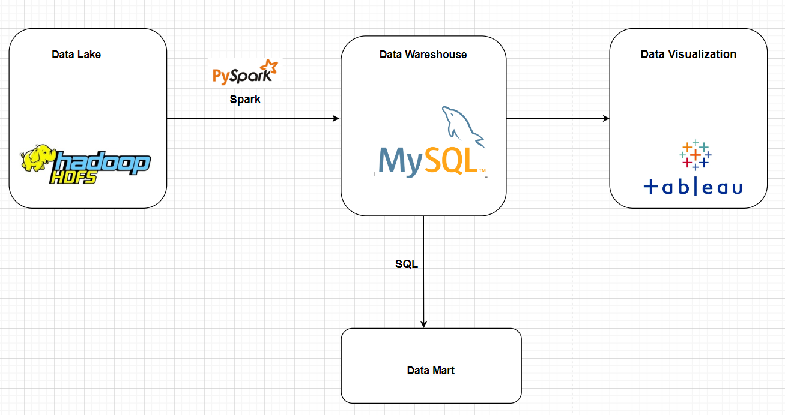
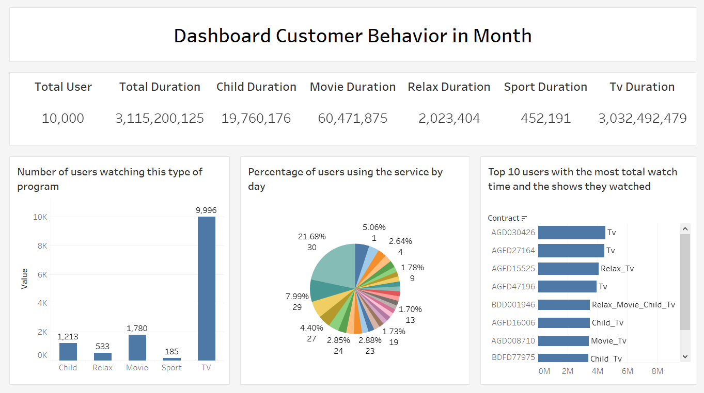

# ETL_Customer_Behavior

## Problem Description
The data engineering project focuses on building a data stream that analyzes the behavior of users using the service for 1 month. User behavior is what TV shows they watched and how much time they watched.
## Main objective
  
## Technologies  
  - Programing language: Python(pyspark), SQL
  - Data Lake: Hadoop HDFS
  - Data Wareshouse: MySQL
  - Data Visualization: Tableau
## Architecture

## Dasboard

